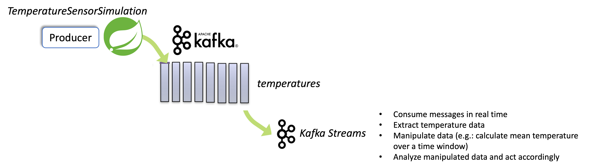

# Kafka Streams Temperatures handling
- [Introduction](#introduction)
- [Setup and run Kafka](#setup-and-run-kafka)
    - [Run Kafka cluster on local environment](#run-kafka-cluster-on-local-environment)
    - [Run Kafka cluster on Confluent](#run-kafka-cluster-on-confluent)
    - [Create, delete and describe Kafka topics](#create-delete-and-describe-kafka-topics)
- [How the application works](#how-the-application-works)
    
## Introduction
This repository holds the code for experimentations on Kafka Streams technology.

It implements a sample Kafka Streams application which continuously reads data published to *temperatures* Kafka topic, manipulate, analyze and act upon
manipulated data.

The Kafka Streams application is depicted at high level in the following picture.



An application which simulates a sensor reading temperature and humidity data and publish to Kafka topic is available in my other code repository 
**https://github.com/robipozzi/robipozzi-kafka-producer-java**.

To access the code, open a Terminal and start by cloning this repository with the following commands:

```
mkdir $HOME/dev
cd $HOME/dev
git clone https://github.com/robipozzi/robipozzi-kafkastreams-temperatures
```

## Setup and run Kafka
To see how a Kafka producer works, you will need to setup a few things in advance, such as a Kafka cluster to interact with and Kafka topic to produce and consume 
messages; also it could be useful to have some Kafka consumers to test the messages have been correctly produced by our Kafka producer: everything is 
already described in details in this GitHub repository https://github.com/robipozzi/robipozzi-kafka, you will find pointers to the appropriate content in the 
paragraphs below.

### Run Kafka cluster on local environment
One option to run a Kafka cluster is obviously installing and running locally, please refer to 
https://github.com/robipozzi/robipozzi-kafka#run-Kafka-cluster-on-local-environment for all the details.

### Run Kafka cluster on Confluent
Another option to setup a Kafka cluster is to use a Cloud solution, for instance Confluent (https://www.confluent.io/), you can refer to 
https://github.com/robipozzi/robipozzi-kafka#run-Kafka-cluster-on-confluent for details regarding this option.

### Create, delete and describe Kafka topics
Once the Kafka cluster has been setup, you can find details on how to manage topics (i.e.: create, delete, ...) at 
https://github.com/robipozzi/robipozzi-kafka#create-delete-and-describe-kafka-topics

## How the application works
The application implements Kafka Streams that reads temperature and humidity data published to a Kafka topic called *temperature* 
(configurable in the **[application.properties](src/main/resources/application.properties)** configuration file.
 
The code for this application is based on:
- **Maven**: here is the **[POM](pom.xml)** that defines project configuration; the library dependencies section is reported here below

```
<dependencies>
	<dependency>
		<groupId>org.springframework.boot</groupId>
		<artifactId>spring-boot-starter-json</artifactId>
	</dependency>
	<dependency>
		<groupId>org.apache.kafka</groupId>
		<artifactId>kafka-streams</artifactId>
	</dependency>
	<dependency>
		<groupId>org.apache.kafka</groupId>
		<artifactId>kafka-clients</artifactId>
	</dependency>
	<dependency>
		<groupId>org.springframework.boot</groupId>
		<artifactId>spring-boot-starter-test</artifactId>
		<scope>test</scope>
	</dependency>
</dependencies>
```
	
- **Spring Boot 3.1.2**: the usage of Spring Boot framework v3.1.2, with all its implicit dependencies, is declared in the same **[POM](pom.xml)**; 
as any Spring Boot application, it has a specific configuration file called **[application.properties](src/main/resources/application.properties)**

```
<parent>
	<groupId>org.springframework.boot</groupId>
	<artifactId>spring-boot-starter-parent</artifactId>
	<version>3.1.2</version>
	<relativePath/> <!-- lookup parent from repository -->
</parent>
```

- **Kafka and Kafka Streams libraries**: they are injected as Spring dependencies, as it can be seen in the **[POM](pom.xml)** dependencies section.

Every Spring Boot application needs to have a main class annotated as **@SpringBootApplication**; our application main class is 
**[KafkaStreamsApp](src/main/java/com/rpozzi/kafkastreams/KafkaStreamsApp.java)**, whose code is reported here below for reference

```
@SpringBootApplication
@ComponentScan(basePackages = { "com.rpozzi.kafkastreams" })
public class KafkaStreamsApp {
	private static final Logger logger = LoggerFactory.getLogger(KafkaStreamsApp.class);
	@Value(value = "${spring.kafka.bootstrap-servers}")
	private String kafkaBootstrapServers;
	@Autowired
	private TemperatureStreamsService temperatureStreamsSrv;

	public static void main(String[] args) {
		SpringApplication.run(KafkaStreamsApp.class, args);
	}

	@Bean
	public CommandLineRunner commandLineRunner(ApplicationContext ctx) {
		return args -> {
			logger.debug("Let's inspect the beans provided by Spring Boot:");
			logger.debug("************** Spring Boot beans - START **************");
			String[] beanNames = ctx.getBeanDefinitionNames();
			Arrays.sort(beanNames);
			for (String beanName : beanNames) {
				logger.debug(beanName);
			}
			logger.debug("************** Spring Boot beans - END **************");
			
			logger.debug("Print application configuration parameters");
			logger.debug("************** Application configuration parameters - START **************");
			logger.debug("Kafka Bootstrap Servers :  " + kafkaBootstrapServers);
			logger.debug("************** Application configuration parameters - END **************");
			
			logger.info("Application " + ctx.getId() + " started !!!");

			// ############### Kafka Streams - Temperature streams service ###############
			temperatureStreamsSrv.process();
		};
	}

}
```

It is out of scope of this doc to explain in detail how Spring Boot works, let's just say that once the application is started via *main()* method, the *commandLineRunner()* method is kicked in, where **temperatureStreamsSrv.process()** is called.

But where **temperatureStreamsSrv** comes from? Well it is just an instance of 
**[TemperatureStreamsService](src/main/java/com/rpozzi/kafkastreams/service/TemperatureStreamsService.java)** class, whose code is reported below 
for reference, injected via the following Spring Boot annotation

```
@Autowired
private TemperatureStreamsService temperatureStreamsSrv;
```

The **[TemperatureStreamsService](src/main/java/com/rpozzi/kafkastreams/service/TemperatureStreamsService.java)** class has a *process()* method 
where Kafka Streams DSL is used to create and run a Stream Processor Topology that does the following:

- reads input records, made of JSON formatted messages with temperature and humidity data 
- extracts temperature data
- aggregates temperatures over a 1-minute time window
- calculates average temperature over the 1-minute time window
- select high temperatures (i.e.: average temperatures higher than an established threshold)
- once average temperature is over a threshold, an action is triggered

Let's see how Kafka Streams works, stepping into *process()* method line by line.

First we need to create a **java.util.Properties** instance and populate it with appropriate info to:

- instruct the application to connect to a Kafka cluster (see how *StreamsConfig.BOOTSTRAP_SERVERS_CONFIG* key is set with the value of Kafka Bootstrap Servers URL);
- define Kafka messages key and value Serializer and Deserializer.

```
Properties props = new Properties();
props.put(StreamsConfig.APPLICATION_ID_CONFIG, kafkaStreamsAppId);
props.put(StreamsConfig.BOOTSTRAP_SERVERS_CONFIG, kafkaBootstrapServers);
props.put(StreamsConfig.DEFAULT_KEY_SERDE_CLASS_CONFIG, Serdes.String().getClass());
props.put(StreamsConfig.DEFAULT_VALUE_SERDE_CLASS_CONFIG, Serdes.String().getClass());
```

Then we need to:

- instantiate a **StreamsBuilder** class;
- create an instance of **KStream**, calling the *StreamsBuilder.stream(<kafka_topic>)* method

```
// Initialize StreamsBuilder
final StreamsBuilder builder = new StreamsBuilder();
		
// Read Stream from input Kafka Topic ${kafka.topic.temperatures} (see application.properties for mapping)
KStream<String, String> sensorData = builder.stream(temperatureKafkaTopic);
```

The above code creates a *KStream* instance called *sensorData*, bound to a specific Kafka topic: the data published to that topic are interpreted as a record stream and several transformations can then be applied to it, using Kafka Streams DSL constructs.

The data published to Kafka topic are in JSON format (see the code for a Kafka producer simulating a temperature and humidity sensor at 
**[robipozzi-kafka-producer-java](https://github.com/robipozzi/robipozzi-kafka-producer-java)** GitHub repo and look specifically how
**[TemperatureSensorSimulationService](src/main/java/com/rpozzi/kafka/service/TemperatureSensorSimulationService.java)** works).

The first transformation is aimed at extracting the temperature data from the message, and this is done by using *mapValues()* Kafka Streams stateless transformation as it can be seen below

```
// ===== Apply mapValues transformation to extract temperature data from input messages
KStream<String, Integer> temperatures = sensorData.mapValues(value -> consumeMsg(value).getTemperature());
```

In Kafka Streams DSL, *mapValues()* takes one record and produces one record, modifying the value of the message, while retaining the key of the original record.

As it can be seen, the new value is set by invoking *consumeMsg(value)* method (see code snippet below), which reads the JSON message and deserializes it
into **[Sensor](src/main/java/com/rpozzi/kafkastreams/dto/Sensor.java)** object, that 
holds a *temperature* property, accessible via its proper getter method.

```
private Sensor consumeMsg(String in) {
	logger.debug("===> running consumeMsg(String in) method ...");
	logger.info("Reading from '" + temperatureKafkaTopic + "' Kafka topic (using SpringBoot Kafka APIs) ...");
	Sensor sensor = null;
	ObjectMapper mapper = new ObjectMapper();
	try {
		logger.debug("Message read : " + in);
		sensor = mapper.readValue(in, Sensor.class);
		logger.info("Temperature = " + sensor.getTemperature() + " - Humidity = " + sensor.getHumidity());
	} catch (JsonMappingException e) {
		logger.error(e.getLocalizedMessage());
		e.printStackTrace();
	} catch (JsonProcessingException e) {
		logger.error(e.getLocalizedMessage());
		e.printStackTrace();
	}
	logger.debug("<=== returning Sensor data ...");
	return sensor;
}
```

The *mapValues()* method, by its nature, creates a new stream, holding new record stream data with the re-mapped message.
 
Now that we have a new stream, named *temperatures*, where temperature data flow, we will apply some further transformations on it to calculate the average
temperature over a 1-minute time window, as it can be seen in code snippet below:

```
// A tumbling time window with a size of 1 minute (and, by definition, an implicit advance interval of 1 minute), and grace period of 1 minute.
Duration windowSize = Duration.ofMinutes(windowSizeMinutes);
Duration gracePeriod = Duration.ofMinutes(gracePeriodMinutes);
		
// Calculate the average temperature in a 1-minute tumbling window
//    
KStream<Windowed<String>, Double> averageTemperatureStream = temperatures
	.groupByKey() /* Key in the original message is always the same, so we can group on it directly */
	.windowedBy(TimeWindows.ofSizeAndGrace(windowSize, gracePeriod))
	.aggregate(
		() -> new TemperatureAggregate(0, 0), /* initializer */
		(key, temperature, temperatureAggregate) -> temperatureAggregate.add(temperature), /* adder */
		Materialized.with(Serdes.String(), new TemperatureAggregateSerde())
	)
	.mapValues((windowedKey, aggregate) -> aggregate.getAverage())
	.toStream();
```

The code above applies the following sequence of transformations: 

1. apply *groupByKey* stateless transformation to group temperature data (since the key is always the same, it groups every temperature in the defined time window)
2. apply *aggregate* stateful transformation temperature data in the time window (it uses *add()* method of *TemperatureAggregate* class to sum up all the temperatures in the time window)
3. apply *mapValues* to produce a record with the same key and average temperature as the value (as calculated by *getAverage()* method of *TemperatureAggregate* class)
4. call *toStream()* method to stream the transformed records to a new KStream named *averageTemperatureStream*

The **[TemperatureAggregate](src/main/java/com/rpozzi/kafkastreams/service/TemperatureAggregate.java)** class exposes 2 convenient methods
* *add()*: which sums temperature data and increment the count of temperature data points coming in
* *getAverage()*: which returns the average temperature (calculated as (sum of temperatures) / (count of temperature data points) in time window)


[TODO]
